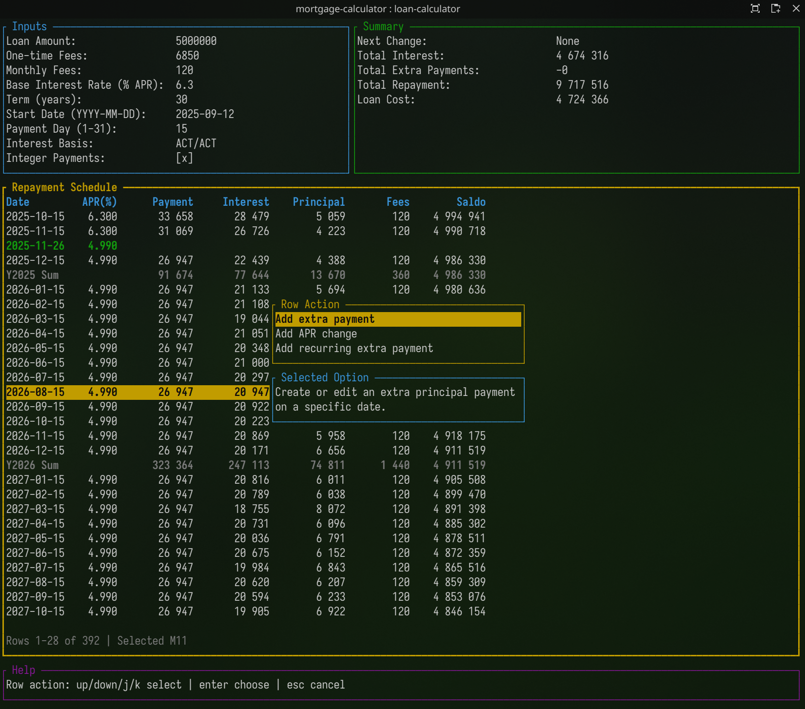

# Mortgage Calculator TUI



This project is a terminal-based mortgage calculator built in Rust.  
It helps you model a loan with daily-interest accrual, APR changes, fees, and extra payments, then inspect the full repayment schedule and summary totals.

## Run

1. Ensure Rust is installed (`rustup` / `cargo`).
2. From the project root, start the app:

```bash
cargo run
```

## License

MIT

